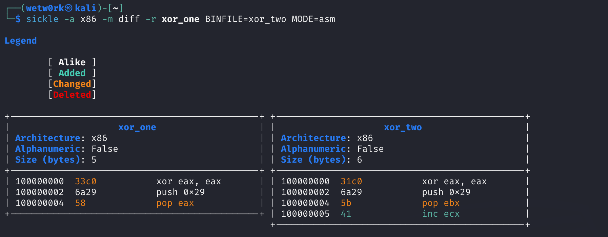

# Sickle


Sickle is a tool I originally developed to help me be more effective, in both developing and understanding shellcode. However, throughout the course of its development and usage It has evolved into a payload development framework. Although current modules are mostly aimed towards assembly, this tool is not limited to shellcode.

Currently sickle can assist in the following.

- Diffing
- Bad Character Identification
- Shellcode Execution
- Disassembly
- Shellcode Extraction

## Diffing

This functionality of sickle was originally implemented to aid me in understanding public shellcode stubs. When assembly diffing is performed the diff will occur on both the assembly and opcode level individually.



Additionally, sickle supports multiple modes in which to perform the diff and can be useful even outside of shellcode development. Notably sickle currently supports both Windows and Linux for all modules not just diffing.


## Shellcode Execution

A task you may find yourself doing repeatedly is testing your shellcode. These steps normally involve:

1. Compiling assembly language
2. Extracting shellcode into the proper format for your respective wrapper
3. Compiling the wrapper
4. Executing it

Although these steps may not seem like a lot they add up when you do them over and over until you get your expected outcome. Sickle takes care of placing the shellcode into a wrapper for quick testing and works on both Windows and Unix systems.


## Disassembly

Sickle can also take a binary file and convert the extracted opcodes (shellcode) to machine instructions (assembly). Keep in mind this works with raw binary only and disassembly is currently only done in a linear fashion.


Shown above the module disassembles a reverse shell designed by Stephen Fewer to assembly.

## Shellcode Extraction

Shellcode extraction was the first module or rather functionality for sickle as opcodes are interpreted differently depending on the wrapper you are using. You cannot expect JavaScript to store and interpret shellcode the same way a C program would.


Perhaps the biggest inspiration for this was `msfvenom`.

## Bad Character Identification

Although not prevalent in 64bit exploits there may be times an exploit restricts certain characters from being used. This is where the pinpoint module shines as it directly shows the assembly instructions responsible for the identified bad character.


# Module Based Design

This tool was originally designed as a one big script, however as the tool evolved, I found myself needing to re-learn my code every update. As such, sickle now follows a modular approach with the goal being to implement new functionality as needed with minimal time spent re-learning sickles design. In addition, this allows for a way to self-document each functionality provided by respective modules.

```
$ sickle -l

  Modules             Description
  -------             -----------
  disassemble         Disassemble bytecode in respective architecture
  diff                Compare two binaries / shellcode(s). Supports hexdump, byte, raw, and asm modes
  format              Format bytecode into desired format / language (-f)
  run                 Execute shellcode on either windows or unix
  badchar             Generate bad characters in respective format
  pinpoint            Pinpoint where in the shellcode bad characters occur

  Formats             Description
  -------             -----------
  c                   Format bytecode for a C application
  java                Format bytecode for Java
  hex                 Format bytecode in hex
  num                 Format bytecode in num format
  powershell          Format bytecode for Powershell
  bash                Format bytecode for bash script (UNIX)
  nasm                Format bytecode for NASM
  raw                 Format bytecode to be written to stdout in raw form
  python3             Format bytecode for Python3
  cs                  Format bytecode for C#
  python              Format bytecode for Python
  uint8array          Format bytecode for Javascript as a Uint8Array directly
  hex_space           Format bytecode in hex, seperated by a space
  dword               Format bytecode in dword
  escaped             Format bytecode for one-liner hex escape paste
  javascript          Format bytecode for Javascript (Blob to send via XHR)
  perl                Format bytecode for Perl
  ruby                Format bytecode for Ruby

  Architectures
  -------------
  x86
  x64
  arm

$ sickle -i -m diff

Usage information for diff module


Description:

  Compare two binaries / shellcode(s). Supports hexdump, byte, raw, and asm modes

Argument Information:

  Argument Name        Argument Description                               Optional
  -------------        --------------------                               --------
  BINFILE              Additional binaries needed to perform diff         no
  MODE                 Method in which to output diff results             no

Argument Options:

  MODE                 Option Description
  ----                 ------------------
  hexdump              Output will include both hexadecimal opcodes and ASCII similiar to hexdump
  byte                 Output will be byte by byte and include individual char representation
  raw                  Output in "raw" format, this is similiar to pythons repr() function
  asm                  Output disassembled opcodes to selected assembly language

Example:

   sickle -a x64 -m diff -r original_shellcode BINFILE=modified_shellcode MODE=asm
```
